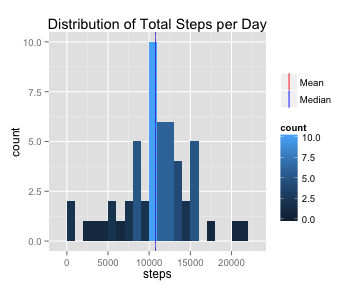
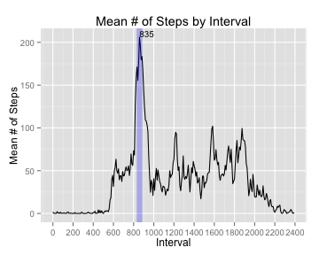
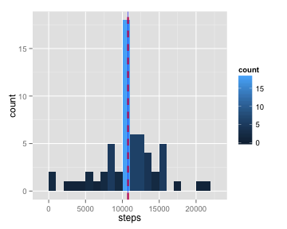
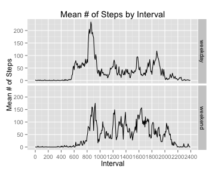

## Loading and preprocessing the data

To start with we'll load the libraries that we require for this exercise, and also the base 'activity' data set.


```r
library(dplyr)    #used for data manipulation/transformation
library(ggplot2)  #used for plotting
library(scales)   #used for plotting against time
library(chron)    #used for a few handy date/time determinations

activityData <- read.csv('activity.csv')
```

There really isn't any specific preprocessing that needs to be done here that is universally applicable to all of the questions being asked/answered.

## What is mean total number of steps taken per day?

Inspection of the data indicates that missing values are restricted to the 'steps' variable and occur on, and comprise, complete days. We'll simply remove these cases from the data.  Then we can summarize the data as the sum total number of steps per day (using dplyr).


```r
completeActivityData <- activityData[complete.cases(activityData),]
totalStepsPerDay <- summarise(group_by(completeActivityData, date), sum(steps))
names(totalStepsPerDay)[2] <- 'steps'
```


At this point we could simply caclualte the mean (10766.189) on the 'steps' variable in the 'totalStepsPerDay' data frame.  But this is boring, so we'll make a nice(ish) plot of the data that shows the mean and median on the distribution.


```r
ggplot(totalStepsPerDay, aes(x=steps)) +
  geom_histogram(aes(fill=..count..), binwidth=1000) + 
  geom_vline(aes(xintercept=mean(steps), color="Mean", linetype='Mean'), size=0.25, show_guide=TRUE) + 
  geom_vline(aes(xintercept=median(steps), color="Median", linetype='Median'), size=0.25, show_guide=TRUE) +
  scale_colour_manual(name='', values=c(Median='blue',Mean='red')) +
  scale_linetype_manual(name='', values=c(Mean='dashed',Median='solid'), guide=FALSE) + 
  labs(title='Distribution of Total Steps per Day')
```

 

Well it turns out that our attempt to be fancy was kind of undermined by a mean and median that are really close, and therefore difficult to separate visually on the histogram.  So here they are in unambiguous, easy to read numbers:


```r
mean(totalStepsPerDay$steps)
```

```
## [1] 10766.19
```

```r
median(totalStepsPerDay$steps)
```

```
## [1] 10765
```

## What is the average daily activity pattern?
For this question we're interested in the average number of steps per interval distributed across the day (i.e. the pattern of activity across an average day).  As such, we'll need to summarize the data as the average number of steps per interval.  Since we can simply ignore missing vaues in the 'mean' calculation, there is no need to remove them from the base data set as we did in the previous section.


```r
avgStepsPerInterval <- summarise(group_by(activityData, interval), mean(steps, na.rm=TRUE))
names(avgStepsPerInterval)[2] <- 'meanSteps'
```

The issue we are going to encounter when we plot this data though is that the five minute intervals are actually organized into blocks labled in hundreds (i.e. the first hour of the day is comprised of intervals 0 to 55, while the second hour of the day is comprised of intervals 100 to 155, the third 200 to 255, etc.).  Treating the interval as a simple integer will lead to some odd patterns in the data at the end of every hour.  As such, we need to plot the data as proper 'time' data.  To do this, we'll control the scale on the X-axis - plotting against continuous minutes, but overlaying intervals.  We'll also identify the interval with the highes average number of steps.


```r
avgStepsPerInterval$minutes <- seq(0,1435,5)

maxInterval <- 
  avgStepsPerInterval$interval[avgStepsPerInterval$meanSteps==max(avgStepsPerInterval$meanSteps)]
maxMinute   <- 
  avgStepsPerInterval$minutes[avgStepsPerInterval$meanSteps==max(avgStepsPerInterval$meanSteps)]

ggplot(avgStepsPerInterval, aes(x=minutes, y=meanSteps)) + 
  geom_line(color='black') +
  scale_x_continuous(name='Interval', breaks=seq(0,1440,120), labels=seq(0,2400,200)) + 
  geom_vline(
    aes(xintercept=maxMinute), color="blue", size=3, alpha=0.25) +
  geom_text(
    data=subset(avgStepsPerInterval, interval == maxInterval),
    aes(label=maxInterval, hjust=0, vjust=0, size=10)) +
  labs(y='Mean # of Steps', title='Mean # of Steps by Interval') + 
  theme(legend.position="none")
```

 

So the interval with the highest mean number of steps is interval 835, which occurs 515 minutes into the day.

## Imputing missing values
So maybe it's time to stop simply ignoring those missig values?  We'll impute them then.

To do this, we'll use the mean value of the inteval (across all days) as the imputed value for the missing intervals.


```r
#Join the interval averages onto the main dataset:
completedData <- left_join(activityData, avgStepsPerInterval, by='interval')
#Replace missing 'steps' values with the averages for the interval:
completedData$steps[is.na(completedData$steps)] <- completedData$meanSteps[is.na(completedData$steps)]
#Drop the unneeded average per interval data:
completedData <- completedData[,1:3]
```

Once we have our 'complete' data set, all we need to do is summarize the data as the sum total number of steps per day (using dplyr) - exactly as we did for the first qestion/answer - and plot it.


```r
totalStepsPerDay_imputed <- summarise(group_by(completedData, date), sum(steps))
names(totalStepsPerDay_imputed)[2] <- 'steps'

ggplot(totalStepsPerDay_imputed, aes(x=steps)) +
  geom_histogram(aes(fill=..count..), binwidth=1000) + 
  geom_vline(aes(xintercept=mean(steps)), color="red", linetype="dashed", size=1) + 
  geom_vline(aes(xintercept=median(steps)), color="blue", size=0.25) 
```

 

Well that turns out not to be terribly exciting.  With the imputed values the data has almost exactly the same distribution as previously shown with missing values. Why is this?  Because, we simply used mean values for intervals, and data is missing in full day chunks.  So we effectively substituted in average days.  This resulted in simply growing the bin that contained the average days.  Maybe we should have been more sensitive to day types?

## Are there differences in activity patterns between weekdays and weekends?

Tanswer this question we will need to distinguish weekdays from weekends in the data.  This is easily accomplished via the 'chron' package.  We'll make this dinstinction in a new factor variable added to the base data set.  We'll also add a continuous minutes variable to the dataset that will help up represent the data correctly when we plot it.


```r
activityData$date <- as.Date(activityData$date, '%Y-%m-%d')
activityData$dayType <- as.factor(ifelse(is.weekend(activityData$date), 'weekend','weekday'))
activityData$minutes <- seq(0,1435,5)
```

Next we'll summarize the data as the mean number of steps per interval with respect to these new variables we've added. (There is technically a 1:1 relationship between interval and minutes, so what we are effectively accomplishing here is segmenting our summary by weekday v. weekend) This sumary is used to impute missing value (identically to how we did earlier), by subbing in interval mean values for missing values.


```r
avgStepsPerInterval <- summarise(group_by(activityData, interval, dayType, minutes), mean(steps, na.rm=TRUE))
names(avgStepsPerInterval) <- c('interval','dayType','minutes','meanSteps')

#Join the interval averages onto the main dataset:
completedData <- left_join(activityData, avgStepsPerInterval, by=c('interval','dayType','minutes'))
#Replace missing 'steps' values with the averages for the interval:
completedData$steps[is.na(completedData$steps)] <- completedData$meanSteps[is.na(completedData$steps)]
#Drop the unneeded average per interval data:
completedData <- completedData[,1:5]
```


Once we have our 'complete' data set, all we need to do is summarize the data as the sum total number of steps per day (using dplyr) - exactly as we did for the second qestion/answer - and plot it.  In this case, the plot is against weekdays and weekends.


```r
avgStepsPerInterval <- summarise(group_by(completedData, interval, dayType, minutes), mean(steps))
names(avgStepsPerInterval)[4] <- 'steps'

ggplot(avgStepsPerInterval, aes(x=minutes, y=steps)) + 
  facet_grid(dayType ~ .) +
  geom_line() +
  scale_x_continuous(name='Interval', breaks=seq(0,1440,120), labels=seq(0,2400,200)) + 
  labs(y='Mean # of Steps', title='Mean # of Steps by Interval')
```

 

Hey!  A result!  Looks like there are differing activity patterns across weekdays and weekends.  But then again - didn't we already know that?  But still.

Thanks for taking the time to read this!
